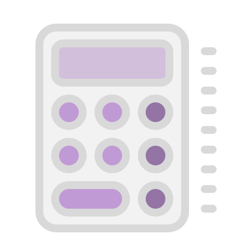

  <h1>jsCalculator</h1>  
  
This is my calculator with space themed colors

  
  
You can check the page, and see it working <a href="https://yasminconstantino.github.io/jsCalculator/">here</a>

  <h4> Languages and Technologies:</h4>
  

    
    
    
  

 
<h5>...</h5>
 
<section>
  

    
Clique aqui para ler em português

    
Essa é a minha calcualdora com uma tematica em cores espaciais

    
Você pode acessar a página e ver ela funcionando <a href="https://yasminconstantino.github.io/jsCalculator/">aqui</a>

    <h4>Linguagens e tecnologias utilizadas:</h4>
    

        
        
        
    

  

</section>
